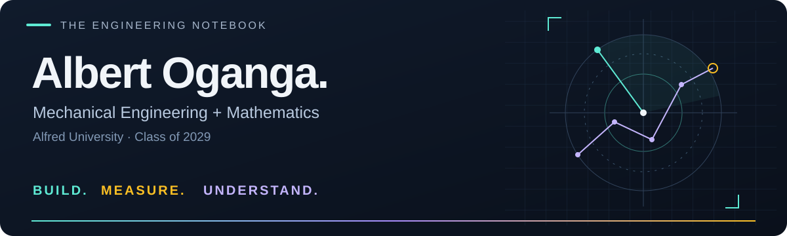

  

  
  

  <a href="#at-a-glance">At a glance</a> ·
  <a href="#toolbox">Toolbox</a> ·
  <a href="#selected-work">Selected work</a> ·
  <a href="#experience">Experience</a> ·
  <a href="#beyond-the-lab">Beyond the lab</a>

I like projects that need both a workbench and a computer. That might mean getting a sensor and servo to work together, writing Python to understand the measurements, or troubleshooting a materials simulation on a computing cluster.

## At a glance

| 🎓 Education | 🛠️ Engineering interests | 🔬 Research experience |
| :--- | :--- | :--- |
| **Mechanical Engineering & Mathematics** Alfred University · Expected May 2029 | **Mechatronics & thermal systems** Embedded sensing · CAD · Experimental testing | **Computational materials** Atomistic modeling · IR spectroscopy · Scientific computing |

## Toolbox

  

| Area | Tools & methods |
| :--- | :--- |
| **Code & data** | Python · MATLAB · C/C++ · NumPy · SciPy · Matplotlib |
| **Hardware & design** | Arduino UNO · ESP32 · HC-SR04 · Servo control · SolidWorks / CAD |
| **Simulation & computing** | PyTorch · CUDA · Linux · HPC / Slurm · LAMMPS · CHGNet · IRIDIA · pymatgen |
| **Testing & analysis** | Experimental design · Thermal testing · Regression · Uncertainty analysis |

## Selected work

<table>
<tr>
<td width="50%" valign="top">

<h3>Servo-Driven Ultrasonic Mapping</h3>

<strong>🟢 In progress</strong> · Aug 2026–present

Combining an HC-SR04 sensor, SG90 servo and Arduino UNO to turn angle–distance readings into a Python 2D map.

<strong>Built so far:</strong> a 30°–150° sweep in 5° increments, independent sensor/servo checks, and serial angle–distance output.

<strong>Next:</strong> quantify range error and repeatability through controlled calibration tests.

<code>Arduino</code> <code>C++</code> <code>Python</code> <code>Sensing</code>

</td>
<td width="50%" valign="top">

<h3>Closed-Loop Smart Cooling Duct</h3>

<strong>🟡 Design & development</strong> · Aug 2026–present

Developing a duct and ESP32-based control system to adjust airflow in response to temperature measurements.

<strong>Current focus:</strong> duct geometry, sensing and C++ control logic.

<strong>Planned validation:</strong> compare thermal response across heat loads and damper settings. Performance results are not yet measured.

<code>ESP32</code> <code>C++</code> <code>CAD</code> <code>Heat transfer</code>

</td>
</tr>
<tr>
<td width="50%" valign="top">

<h3>Computational IR Spectroscopy</h3>

<strong>🟣 Summer research</strong> · May–Aug 2026

Studied calcium aluminosilicate glasses using IRIDIA and CHGNet workflows, connecting atomic structure with infrared spectra.

<strong>Scope:</strong> six compositions, with analysis focused on the 900–1100 cm⁻¹ region and contributions from different atomic environments.

<code>CHGNet</code> <code>IRIDIA</code> <code>Python</code> <code>HPC</code>

</td>
<td width="50%" valign="top">

<h3>Hollow-Rod Heat-Transfer Study</h3>

<strong>🔵 Completed study</strong> · Oct–Dec 2024

Investigated how hollow-rod geometry affects thermal response, using repeated measurements and regression analysis.

<strong>Dataset:</strong> 60 trials across 10 diameters.

<strong>Observed response times:</strong> 75.82 s to 40.31 s across the tested geometries.

<code>Thermal testing</code> <code>Regression</code> <code>Experimental design</code>

</td>
</tr>
</table>

Project illustrations are schematic, not measured plots. These summaries cover work beyond GitHub; project code and full documentation are not yet published here.

## Experience

**🔬 Summer Undergraduate Researcher · Alfred University**  
*May–Aug 2026 · Advisor: Dr. Rebecca Welch*

Developed and troubleshot computational IR-spectroscopy workflows for calcium aluminosilicate glasses. Worked through simulation, spectral analysis and HPC environment issues using Python, PyTorch, CUDA and Slurm.

**⚡ Siemens Energy · Virtual Work Experience**  
*Oct–Nov 2025*

Explored E-STATCOM supercapacitor systems, wind-transformer manufacturing and HVDC applications through a virtual industry program.

**🌱 Co-founder · Student Enrichment Program**  
*Founded Sept 2023*

Helped build a student-led mentoring initiative that reached 200+ students through STEM support, webinars and university-application guidance.

<strong>More: leadership & academic foundation</strong>

- **NSBE:** Co-President & Founder, starting Feb 2026.
- **ColorStack at Alfred:** Co-founder, helping build a student community around computing and technical opportunities.
- **Academic foundation:** calculus, physics, MATLAB and CAD, with interests spanning mechanics, thermal systems and materials.
- **Fall 2025:** 4.0 semester GPA and Dean's List.

## Beyond the lab

Hiking, chess, traveling and aviation. I also co-founded the Student Enrichment Program because access to good guidance can change what a student thinks is possible.

---

<strong>Have a hardware, thermal-systems or research project in mind?</strong> <a href="mailto:ogangaalbert005@gmail.com">Let's talk.</a>

<!-- Design: repository-local SVG illustrations; technology icons by https://github.com/tandpfun/skill-icons; contact badges by https://shields.io. -->
